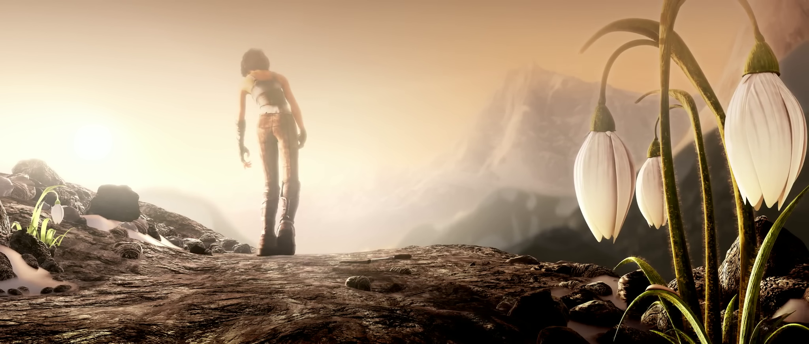
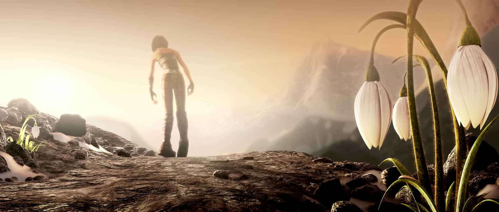
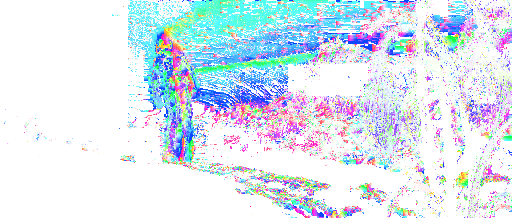
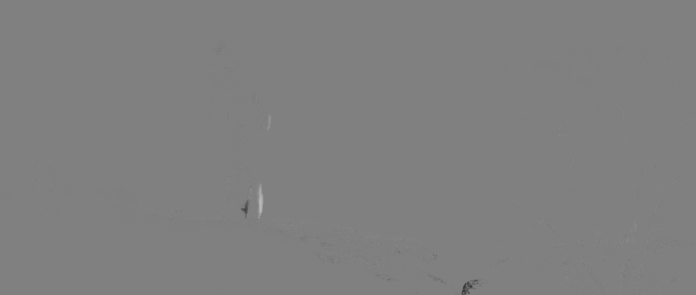
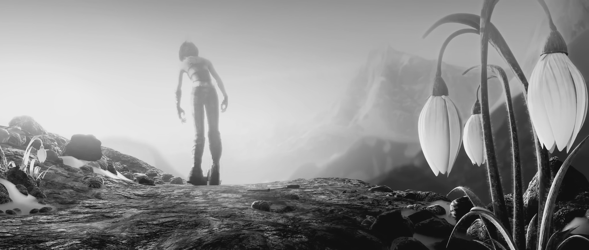
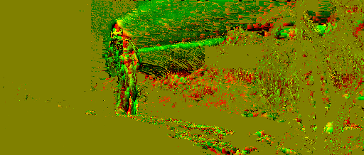

# Tinybma
*An optical flowmap generator from motion vectors using a Full Search Block Matching Algorithms (FSBMA) written in c++*

**Features:**
- SAD based motion compensation on the luma chanel **only** (input images are converted from full sRGB to YUV BT.601)
- **New:** Bilinear subpixel motion compensation !
- Two visualization mode for computed motion vectors:
    - **HSV** mode where hue encodes orientation and value encodes normalized norm relative to the maximum displacement
    - **UV** mode where the red and green channels encode horizontal and vertical displacement
- Luma, residue and prediction visualization
- **Reasonably fast**: Block search and pixels transforms use all available cpu cores

<details>

<summary>Video demo </summary>

- **Badapple but its a block matched motion compensation !** (before the 2026/03/09 update)
    [](https://www.youtube.com/watch?v=JUaUOEDbU1Y)

</details>

## Build

```bash
cmake -DCMAKE_BUILD_TYPE=Release .
cmake --build .
```

## Usage

Use `tinybma -h` to display program help.

### Example
```bash
tinybma ./example/sintel_source.png ./example/sintel_target.png ./example/flowmap_b4_m16.png -v -b 4 -m 16 -l -r -p -s 1 -c hsv 
```

Which produces the following optical flowmap and residue based on two frames from The Blender open movie project [Sintel](https://durian.blender.org/):

<p align="center">
    
    Original reference frame (left) and original target frame (right)
</p>

<p align="center">
    
    1/4 optical flowmap with max search of 16px + 1 subpixel (left) and its residual residual image (right)
</p>
<p align="center">
    <br/>
    Predicted luma frame from computed motion vectors and residue
</p>


### Available colormaps

||HSV map | UV map|
|-------|------|-----------------------------------------------------------------------------------------------------------------------|
|Option | `--colormap hsv` or `-c hsv`      | `--colormap uv` or `-c uv`             |
|Result|  |   |

## Changelogs

- **2026/03/09**
    - Added prediction frame visualisation
    - Fixed residue visualisation, now negative values were campled to 0
    - Added subpixel motion based on bilinear upsampling after whole pixel motion
    - Switched search metric from MSE to SAD